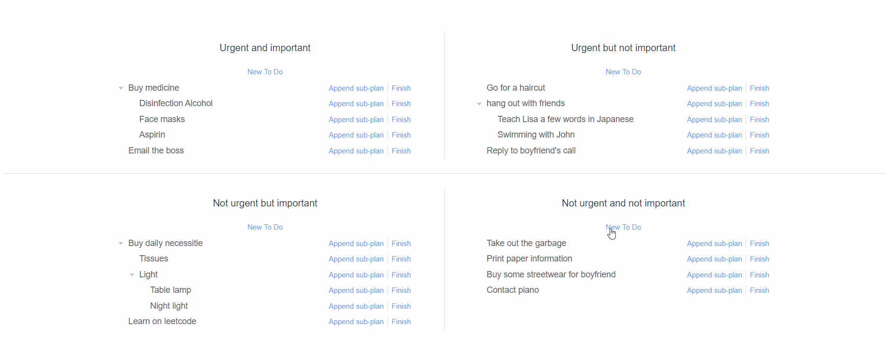
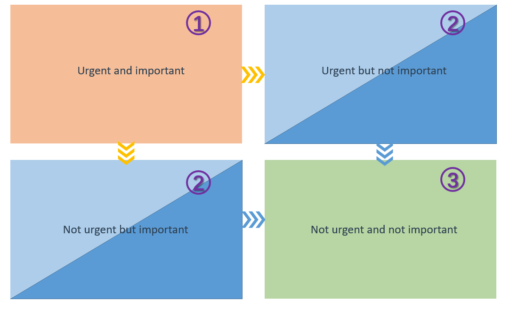
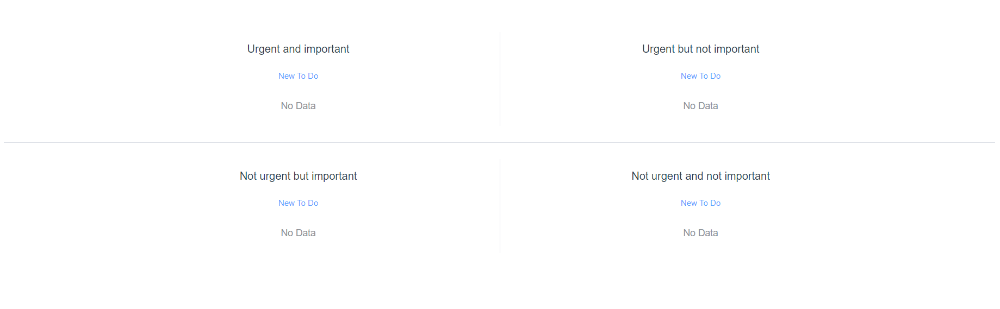
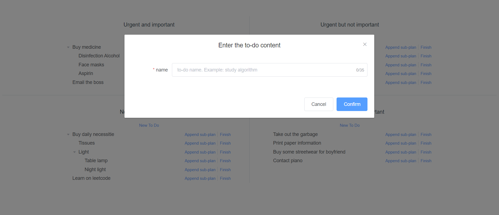
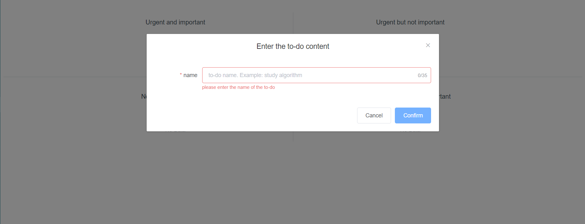
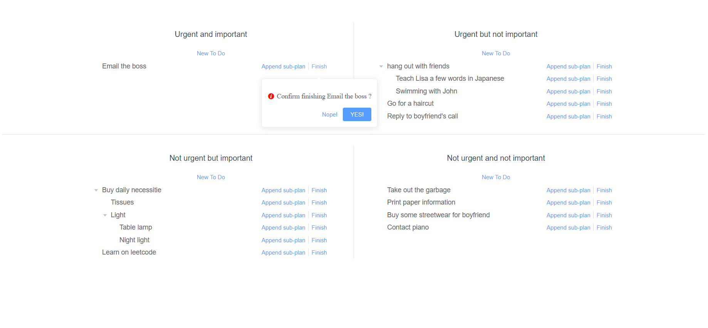
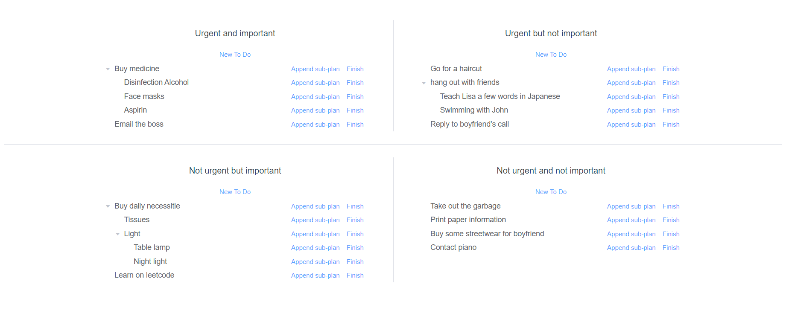

# kony to do 

## How To Fun? 🎉

visit [demo](https://todo.ehyl12168.xyz/) for fun! 👔

## What is this? ❓

*Kony To Do* is a **local quartered nested draggable to-do list** developed by Vue and Element-UI. 🎈

You can easily plan your tasks and goals here. 👧

## What Do We Have？✨

**quartered areas** to categorize your plan according to urgency and importance 📝

Countless **nested sub-plans** 🔽

**Draggable** design 📐

**Friendly user interaction** 😊

Will not store, transmit or disclose your personal information and data 👨‍⚖️

## How To Schedule Your Tasks 💪

You will definitely encounter many tasks and goals in your life. They require time and energy. 😥

If too much, you will be overwhelmed, and tend to take care of one but not the other. 😵

Based on experience, my personal solution and habit is to divide tasks this way. 🍭

According to the **urgency and importance** of tasks, you can make four blocks. 📝

Then, **analyze and sort each block**. 👁‍🗨

Now start from **the first block** at top left and solve tasks **sequentially**. 👌

After finished first block, try to solve tasks of **top right and bottom left blocks alternated one by one**.  😋

Finally, just go and complete the block in the lower right area sequentially! 😄

If you have other tasks to join during the period, please just follow the principles above. 👍

Here's an demo you can refer to : 🎁

In this way, you can perform each task and goal efficiently and without omission. 😁

## Content display 😎

